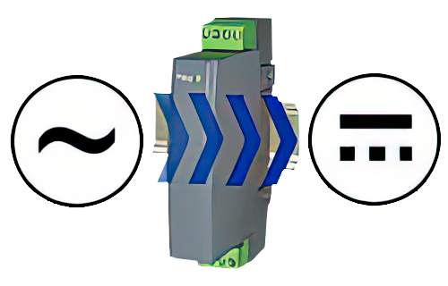
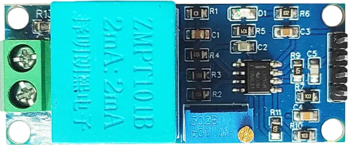

# Three-phase Voltage Transducer

The voltage transducer is the device responsible for measuring the voltage signal generated by the electromechanical system and converting it into a signal compatible with the microcontroller's acquisition stage, through the corresponding signal conditioning. There are various types of voltage transducers, with analog or digital outputs, depending on their measurement principle and the system's interface requirements.

  

##  ZMPT101B Sensor

The ZMPT101B is a single-phase AC voltage transducer that uses a microtransformer to measure AC voltages with galvanic isolation. The module integrates an amplifier and a potentiometer for calibrating the gain, delivering a proportional analog signal suitable for reading with microcontrollers.

  

### Features

* Galvanic isolation via microtransformer, safe for network measurements.
* Module with conditioning stage: operational amplifier and adjustment trimmer.
* Proportional analog output, compatible with 3.3 V and 5 V ADCs.
* Nominal frequency: 50/60 Hz; good linearity in residential and industrial applications.

## Signal Conditioning

The ZMPT101B module delivers an analog signal proportional to the AC input voltage. When powered by 3.3 V, the output is an alternating signal superimposed on a reference level of 1.65 V, so that variations around that point are proportional to the measured voltage and can be sampled with an analog-to-digital converter from the [ESP32](./central_controller.md).

  

Thanks to this module, it is possible to record a representative AC voltage signal with little more than a direct connection between the ZMPT101B module and the microcontroller. In this way, signal conditioning is reduced to the inclusion of a capacitor designed to filter high-frequency components and improve the performance of the microcontroller's analog-to-digital converter (ADC) during sampling.

  

Since the ZMPT101B sensor is a single-phase device, its application in three-phase voltage measurement is limited. To compensate for this restriction, it is proposed to use three ZMPT101B sensors, each dedicated to one phase of the system, thus obtaining an effective three-phase measurement.
