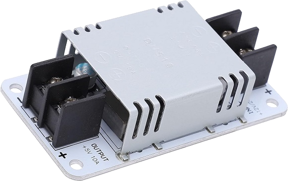
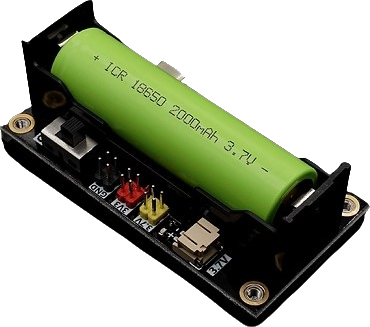

# Module power supply

The module's power supply must be reliable, stable, and uninterrupted. Since data is transmitted 24/7, it is essential to avoid shutdowns in the event of any contingency. This requires a power supply system that anticipates possible failures and, as far as possible, mitigates or counteracts them.
## Requirements

- **Power Supply:** The main power supply is the electromechanical system battery, so the module must be able to draw power from this source.
- **Uninterrupted Power Supply:** The module must continue to operate even if the main power source is interrupted, so it must include a system that guarantees a continuous power supply.
- **Stable voltage level:** Both the [ESP32](./central_controller.md) and the other components of the module require a 3.3-volt power supply. Therefore, the power supply system must guarantee a stable source for the module.

To meet these requirements, two modules are selected to form the power supply system.

## DC-DC step-down converter

- Input: 12–24 VDC. Output: 5 VDC.
- Maximum power: 50 W. Efficiency: 95%.
- Protections: overcurrent, overvoltage, overtemperature, shutdown, and short circuit.
- Temperature range: −40 to 85 °C

  

### 18650 battery UPS module
- Input: 5 VDC. Output: 3.3 VDC (800mA), 3.7VDC.
- With on/off switch.
- Low voltage and overcharge protection activation button.
- Maximum battery protection current limit: 2A.

  

With this arrangement, the DC-DC converter is connected to the electromechanical system battery and delivers a fixed 5 V. That voltage powers the UPS module, which charges its 18650 cell and, through its 3.3 V regulator, supplies a stable voltage to the module.

  

In this way, the power supply system has protections against battery contingencies (voltage drops, short circuits, etc.). In addition, if the power supply is interrupted, the UPS kicks in instantly, ensuring continuity and preventing the module from shutting down.