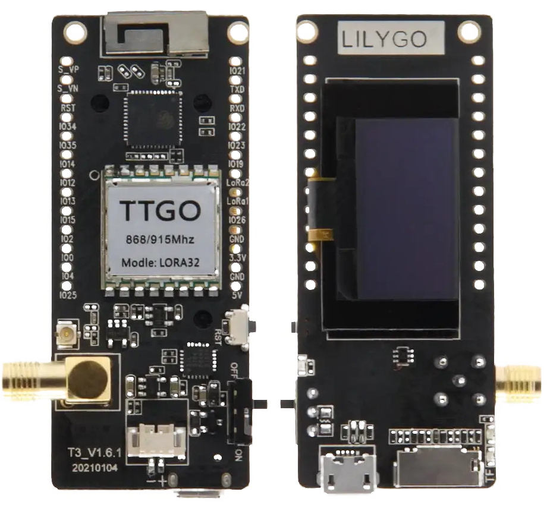

# Controlador Central

Como dispositivo de control central se requiere un microcontrolador con alta capacidad de cómputo, múltiples interfaces de entrada/salida, conversión analógica–digital integrada y capacidades de comunicación robustas. Por estos motivos se selecciona la familia ESP32, que ofrece un balance adecuado entre desempeño, conectividad inalámbrica, ecosistema de desarrollo y costo, permitiendo ejecutar procesamiento local, gestión de comunicaciones y control en tiempo real dentro de un solo SoC.

## Selección del módulo

Para acelerar el desarrollo y consolidar en una sola placa las funciones de cómputo, radio y alimentación, se selecciona el módulo/placa TTGO LoRa32 v2.1, basado en el SoC ESP32‑PICO‑D4 e integrado con un transceptor LoRa de la familia SX127x. Esta elección proporciona un entorno listo para prototipado y operación, con conectividad inalámbrica y recursos de E/S suficientes para la adquisición y transmisión de datos del sistema.

  

### Capacidades del SoC ESP32 PICO D4

* CPU: doble núcleo Xtensa LX6 hasta 240 MHz, con coprocesador ULP para tareas de ultra bajo consumo.
* Memoria: SRAM integrada y soporte para Flash externa; DMA para periféricos de alto rendimiento.
* ADC/DAC: ADC de 12 bits con múltiples canales y 2 DAC de 8 bits
* GPIO e interfaces: UART, I2C, SPI, I2S, PWM (ledc), RMT, SD/SDIO; Ethernet MAC y CAN (TWAI).
* Seguridad: cifrado AES, SHA, RSA/ECC, HMAC; Secure Boot y Flash Encryption.
* Rango de temperatura industrial: −40 °C a +85 °C.

### Radio LoRa integrada

La TTGO LoRa32 v2.1 incorpora un transceptor LoRa SX1276 compatible con LoRaWAN en la banda regional objetivo (868/915 MHz), con factores de dispersión y anchos de banda configurables, y potencia de transmisión ajustable para enlaces de largo alcance.

### Características relevantes de la placa TTGO LoRa32 v2.1

* Alimentación: regulador integrado, entrada por USB y pin 3V3; cargador para batería Li‑ion/Li‑Po con conector JST.
* Interfaz de usuario: pantalla OLED integrada, botones y LED de estado para diagnóstico local.
* Conectividad y programación: puerto USB‑UART para programación/depuración y soporte de logs; antena para LoRa incluida.